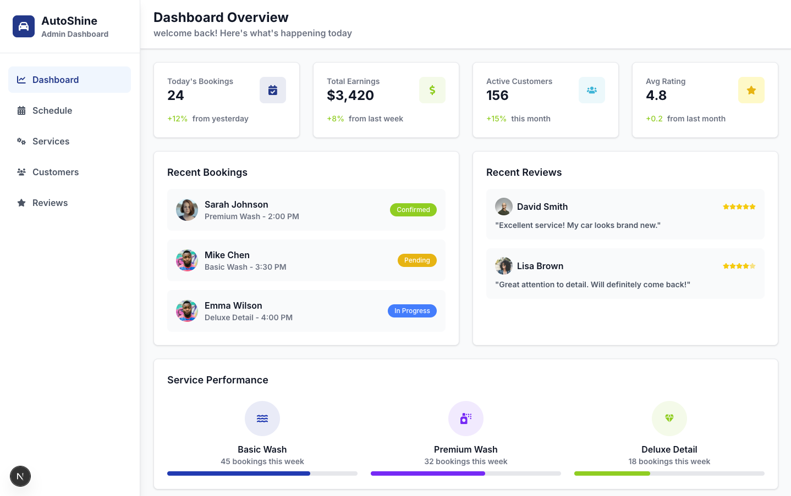
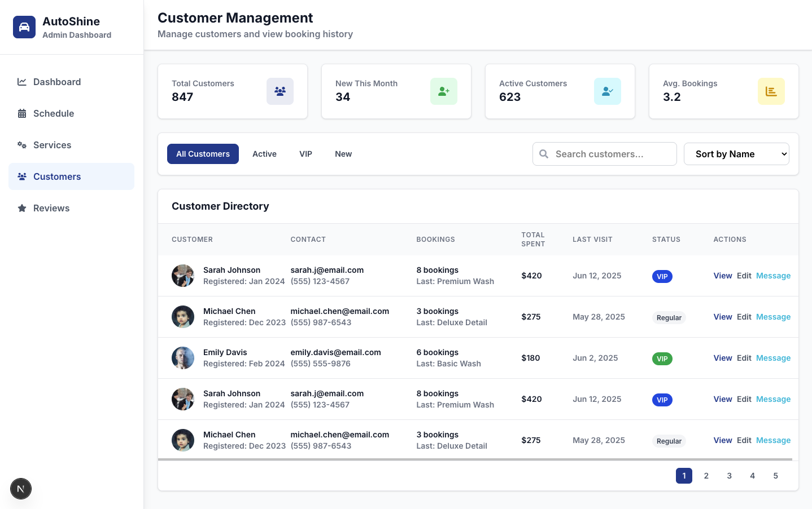
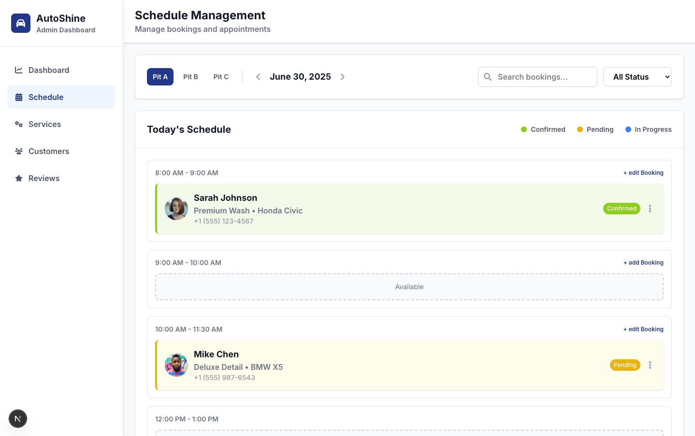
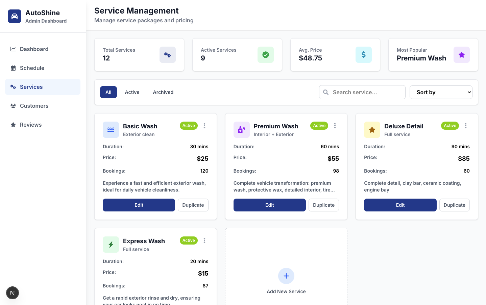
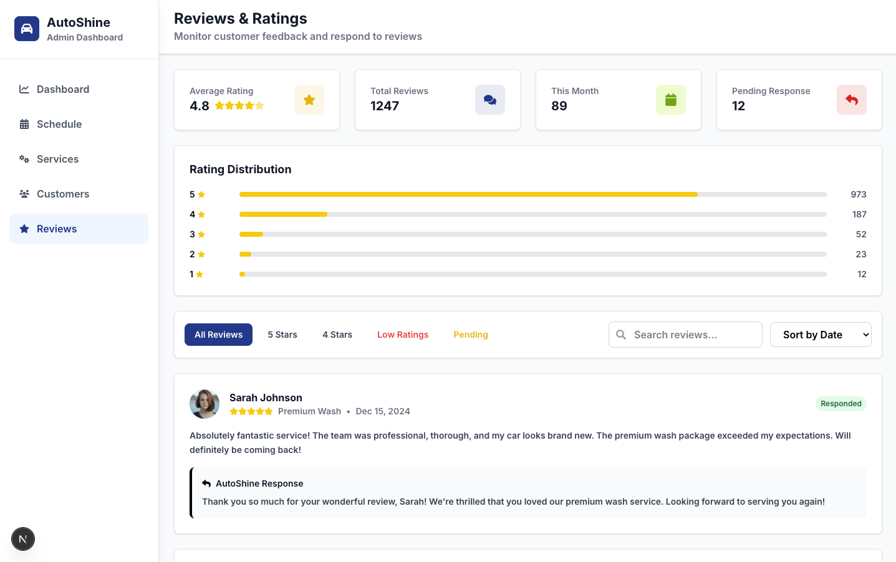
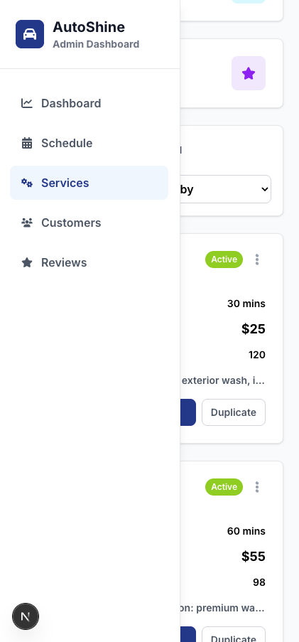
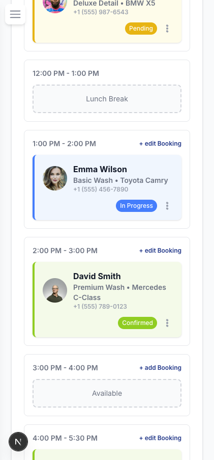
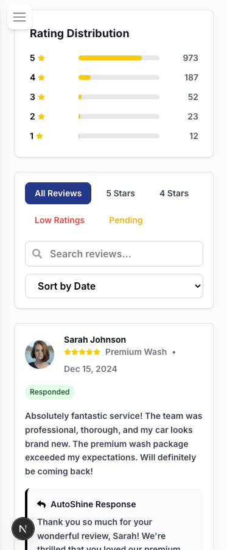

# AutoShine Garage - Dashboard Preview

The **AutoShine Garage Dashboard** is an admin interface designed to efficiently manage car salon booking services. This is a **UI preview only** and is **not connected to any backend or database**.
Built using **Next.js (App Router)**, **TypeScript**, **Tailwind CSS**, and **Zustand** for state management.

> ✅ Deployed on [Vercel](https://autoshine-garage.vercel.app/dashboard) <br>
> ❌ Not connected to backend or database

> 📚 This project was created as a **learning exercise** for mastering **Next.js App Router** and **Zustand**.
> 🧩 It’s a **UI clone** of a freelance project I worked on in 2023 for one of the most well-known car salons in Bali.

---

## Tech Stack

* **Framework:** [Next.js 14+](https://nextjs.org/) with App Router
* **Language:** TypeScript
* **Styling:** Tailwind CSS
* **State Management:** Zustand
* **Deployment:** Vercel

---

## Project Structure

```
app/
├── components/         # UI Components (Cards, Tables, Buttons, etc.)
├── customers/          # Customer management UI
├── dashboard/          # Dashboard overview UI
├── reviews/            # Customer review management
├── schedule/           # Booking schedule section (UI only)
├── services/           # Salon service listing and editor (UI only)
├── layout.tsx          # Shared layout wrapper
├── page.tsx            # Homepage/dashboard entry
├── globals.css         # Global Tailwind styles
interfaces/             # TypeScript interfaces
preview_images/         # Screenshot folder (for README visuals)
public/                 # Static assets
store/                  # Zustand store configs
```

---

## Preview

#### Desktop Screens

| Dashboard                           | Customers                           | Schedule                           |
| ----------------------------------- | ----------------------------------- | ---------------------------------- |
|  |  |  |

| Services                            | Reviews                             |
| ----------------------------------- | ----------------------------------- |
|   |    |


#### Mobile Screens

<p>
  
  
  
</p>


---

## Installation & Local Development

To clone and run this project locally:

```bash
# 1. Clone the repository
git clone https://github.com/username/autoshine-dashboard.git
cd autoshine-dashboard

# 2. Install dependencies
npm install

# 3. Start the development server
npm run dev
```

The app will be running at `http://localhost:3000`

---

## ⚠️ Limitations

* Backend is not implemented (static/mock data only)
* No user/admin authentication
* No live *edit/save/delete* functionality
* Filtering & pagination are UI-only for now

---

## License

MIT License. Feel free to use, fork, or contribute.
